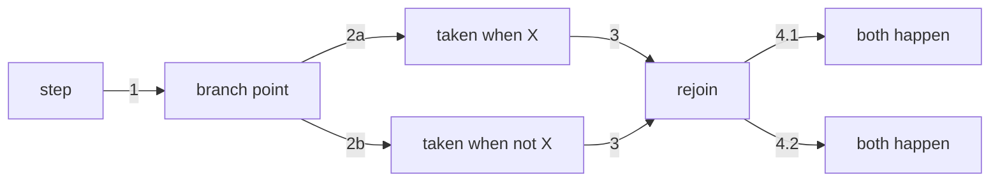
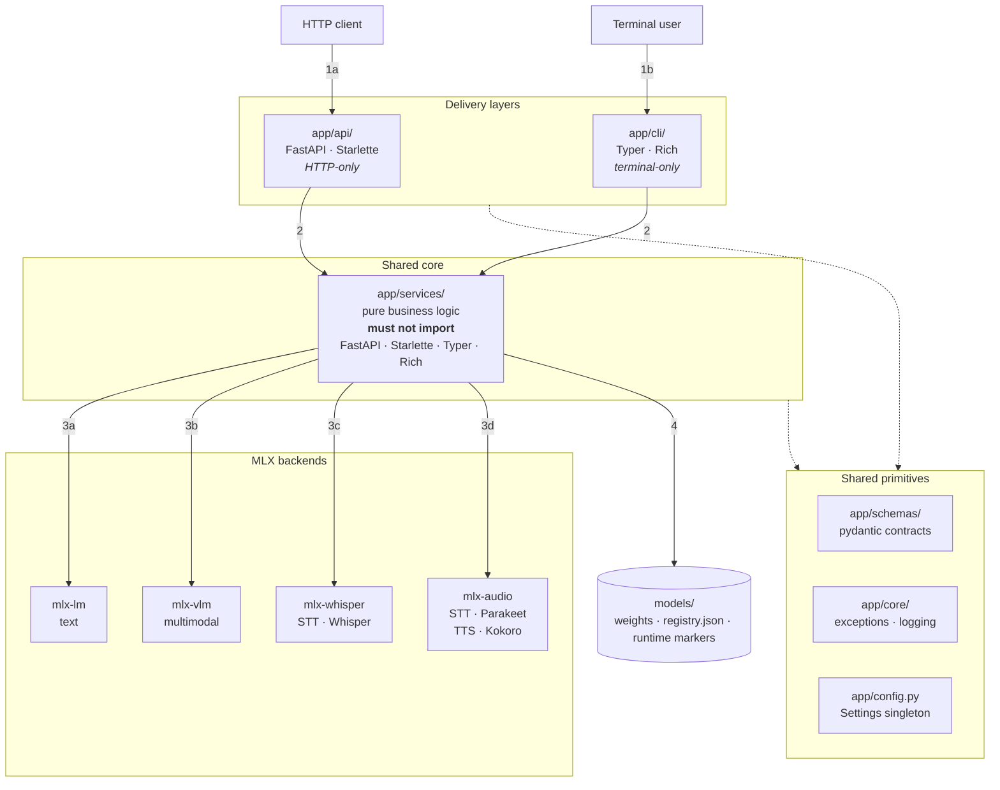
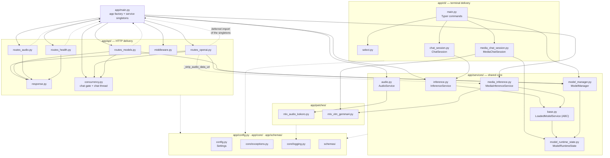
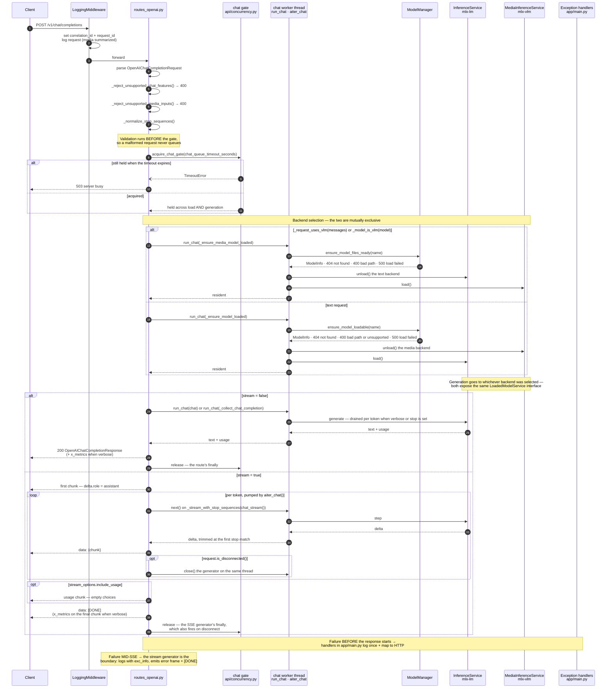
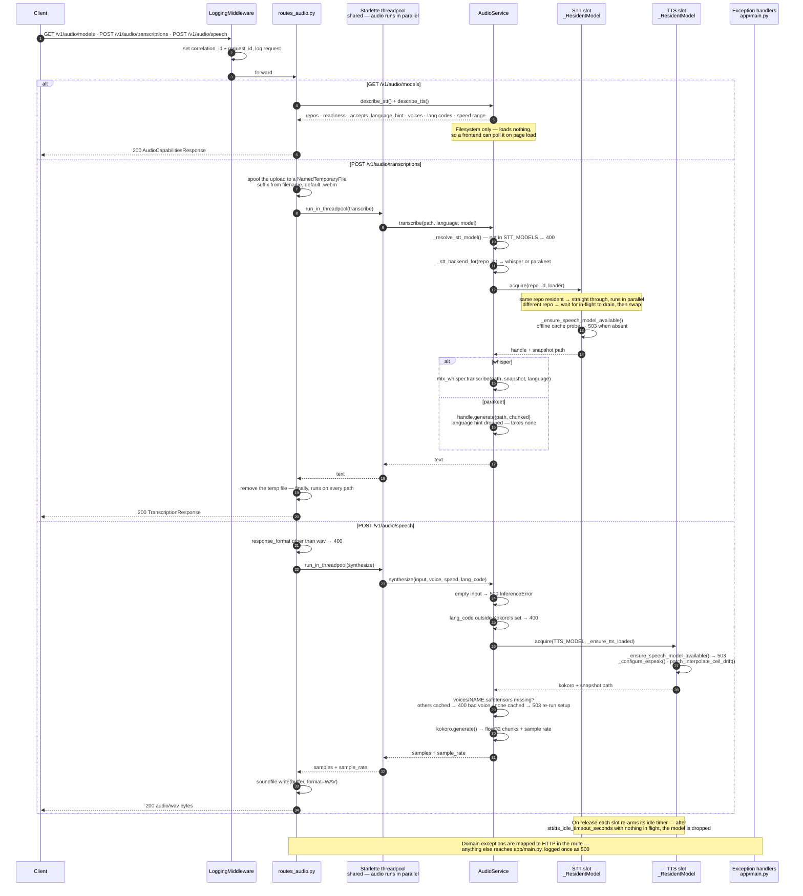
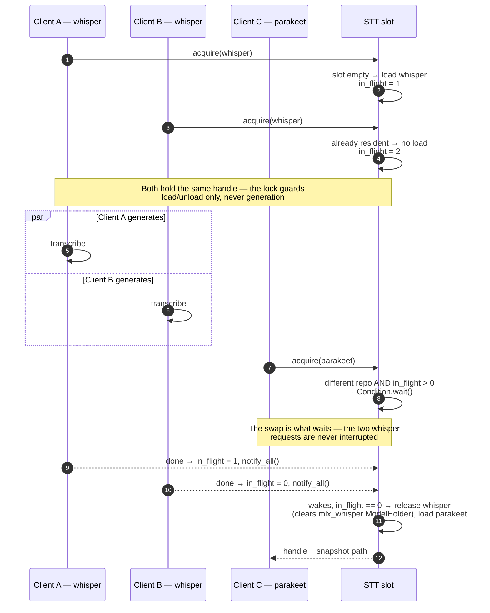
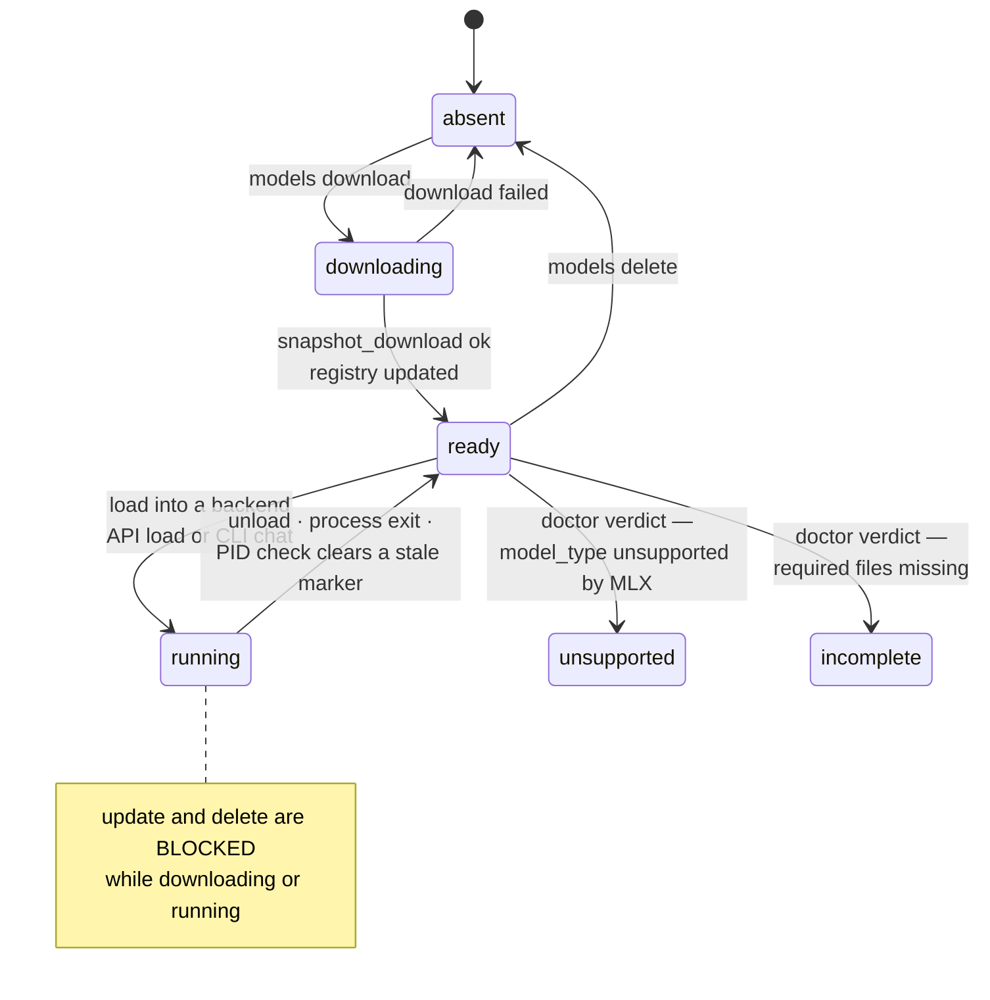
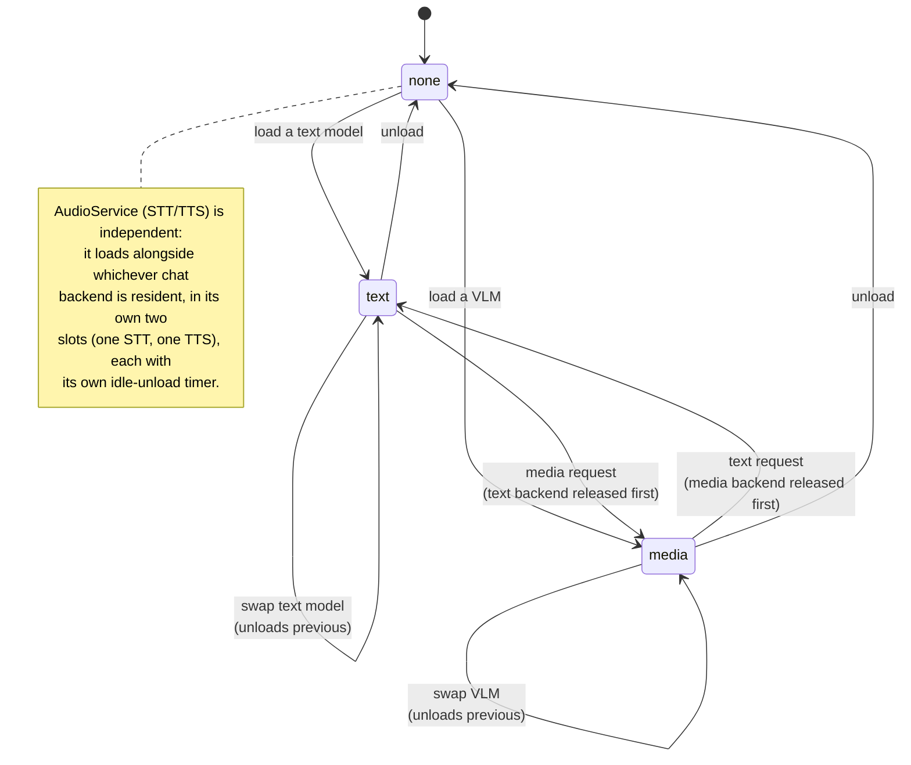

# System Design

Diagrams only. For the written breakdown — directory map, naming conventions, and
what each component does — see [structure.md](structure.md).

## Reading the numbers

Edges that represent a **step in a flow** are numbered so a path can be followed
in order. Edges that represent **structure** (an import, "depends on") are never
numbered — that difference is the point of the notation.

| Situation | Notation | Read it as |
|---|---|---|
| Linear step | `1`, `2`, `3` | happens next |
| **Split — either/or** (one branch is taken) | same number, letter suffix: `2a`, `2b` | *or* |
| **Split — fan-out** (every branch is taken) | dotted decimal: `4.1`, `4.2` | *and* |
| **Converge** (branches rejoin) | the shared number repeats on both incoming edges | both paths arrive at the same step |
| Structural / dependency edge | no label | not part of any flow |

So when an arrow reaches a box and then splits in two, the question is whether the
flow picks one exit or takes both. Picks one → `2a` / `2b` (they are the *same*
step, two outcomes, so the counter does **not** advance twice). Takes both →
`4.1` / `4.2` (one step, two effects). When the branches meet again, the next
number is written once on each incoming arrow, not renumbered per branch:

Two diagram types opt out:

- **Sequence diagrams** use mermaid's `autonumber`, which counts messages
  linearly. Branching is already expressed by the `alt` / `else` blocks, so the
  letter suffixes are redundant there — an `alt` block visually brackets its own
  alternative.
- **State diagrams** and the **module dependency graph** have no step order at
  all: their edges are transitions and imports, not a sequence. They stay
  unnumbered.

## Layers

Two delivery mechanisms over one framework-free service core. Numbers trace one
request; `1a`/`1b` are the two entry points, `3a`–`3d` the backend a request
lands on (exactly one per request).

## Module dependency graph

Who imports whom inside `app/`. Every module also imports from
`app/config.py` + `app/core/` (and most from `app/schemas/`); those edges are
aggregated as the dotted lines at the bottom to keep the graph readable.

`MediaChatSession` is deliberately **not** wired to `MediaInferenceService`: it
imports `mlx_vlm` directly via `importlib` and manages its own runtime marker.
Only the HTTP path uses `MediaInferenceService`.

## Request flow — `POST /v1/chat/completions`

One chat request at a time: the gate is taken after validation and held across
model load *and* the entire generation. All blocking MLX work runs on the single
chat worker thread.

## Request flow — `/v1/audio/*`

Audio never blocks the event loop and never queues behind chat: every call is
handed to the shared Starlette threadpool, so transcriptions and syntheses run
in parallel with each other and with a chat generation. A request **never
downloads** — `task audio:setup` is the only fetch path.

## Audio slot residency — parallel vs swap

Why a shared threadpool is safe: `_ResidentModel` decides per request whether to
run straight through or wait. Same model → concurrent. Different model → the
swap blocks until the in-flight requests finish, so a handle is never pulled out
from under a running generate.

## Model lifecycle

States are visible across processes via marker files in `models/runtime/`.

## Backend mutual exclusion

Loading into one backend releases the other — limited unified memory.

